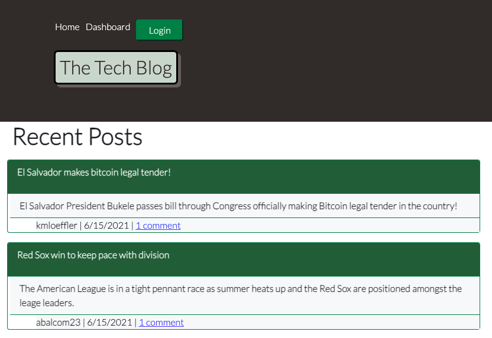

# Tech-Blog

# Table of Contents

- [Description](#description)
- [Installation](#installation)
- [Usage](#usage)
- [Contributing](#contributing)
- [Test](#test)
- [Credits](#credits)
- [License](#license)
- [Questions](#questions)

## Description:

This app was made with JavaScript, MYSQL, Sequelize, Express, Handlebars.js, Bootstrap, and Node.js.

[Link to Deployed App](https://glacial-badlands-18828.herokuapp.com/login)

## Installation:
n/a

## Usage:
Tech-blog site mock-up that allows users to create new accounts so that they can create, read, update, and delete posts. The user can also comment on posts from others.

## Contributing:
Please submit a pull request.  For large changes please email me first.

## Test: 
n/a

## Credits/Collaberators:
Patrick Sullivan [Github](https://github.com/shabobble/ecommerce-backend)  
Erica Fagioli [Github](https://github.com/efagioli01/Object-Relational-Mapping-E-Commerce-Back-End)  
Swetha Reddivari [Github](https://github.com/swethareddyl/E-Commerce_Backend)  

## License:
For more information about the License, click on the link below.

## Issues:
Deleting a post generates an "internal server error" for posts that have been modified from their original state.

- [License](https://opensource.org/licenses/ISC)

##  Questions:
For questions about the app you can go to my 
Github page at the following link:

- [Github Profile](https://github.com/abalcs)

For additional questions please reach out to me via email at: abalcom23@gmail.com.
